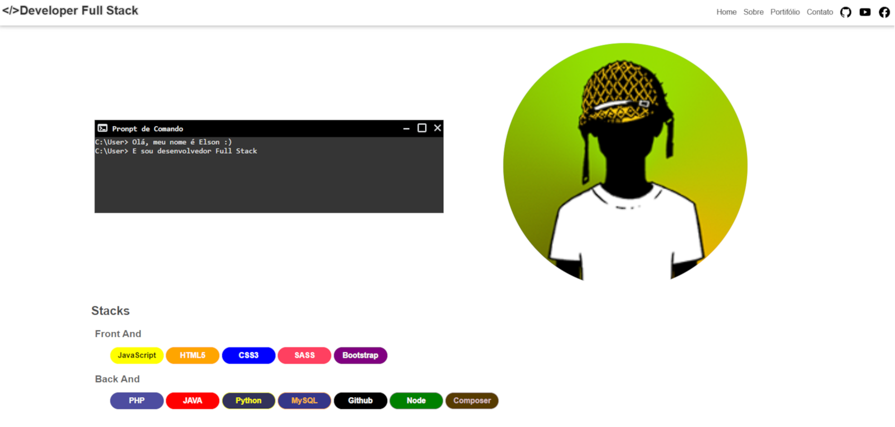

# Meu Portfólio 
Este projeto é de um site estático responsivo, no qual falo um pouco sobre mim, minhas habilidades como desenvolvedor de software e minhas experiências em projetos nos quais já trabalhei.

Este site está disponível em
<a href="https://elson07.github.io/elsonnunes/" target="_blank">
<svg style="position: relative; top: 5px;" xmlns="http://www.w3.org/2000/svg" width="20" height="20" fill="currentColor" class="bi bi-link-45deg cabecalho-link-portifolio-icon" viewBox="0 0 16 16"><path d="M4.715 6.542 3.343 7.914a3 3 0 1 0 4.243 4.243l1.828-1.829A3 3 0 0 0 8.586 5.5L8 6.086a1 1 0 0 0-.154.199 2 2 0 0 1 .861 3.337L6.88 11.45a2 2 0 1 1-2.83-2.83l.793-.792a4 4 0 0 1-.128-1.287z"/><path d="M6.586 4.672A3 3 0 0 0 7.414 9.5l.775-.776a2 2 0 0 1-.896-3.346L9.12 3.55a2 2 0 1 1 2.83 2.83l-.793.792c.112.42.155.855.128 1.287l1.372-1.372a3 3 0 1 0-4.243-4.243z"/></svg> https://elson07.github.io/elsonnunes/
</a>

## Desenvolvido em 
>  HTML 5 
>  JavaScript 
>  CSS3 
>  EmailJS

## Conteúdo do portfólio  
**Menu de navegação**
> Links de navegação horizontal (mostrando todos os links) ou vertical (que só é exibido ao clicar no botão hambúrguer), dependendo da resolução da tela do dispositivo. Os links referem-se a Home, Sobre, Projetos, Contato, GitHub, YouTube e Facebook.

**Home**
> Uma breve apresentação sobre as tecnologias que domino.

**Sobre**
> Um texto sobre mim e alguns containers que contêm minha formação e a descrição de cada curso.

**Projetos**
> Alguns projetos nos quais eu trabalhei, contendo o link para teste, imagem e vídeo de testes de usabilidade, descrição e as tecnologias que compõem o projeto.

**Contato**
> Formas de contato, como telefone, WhatsApp, e-mail e formulário para envio de mensagens, em que implementei uma API de envio e recebimento de e-mail, o 'EmailJS'.
## Imagem do aplicativo

	

